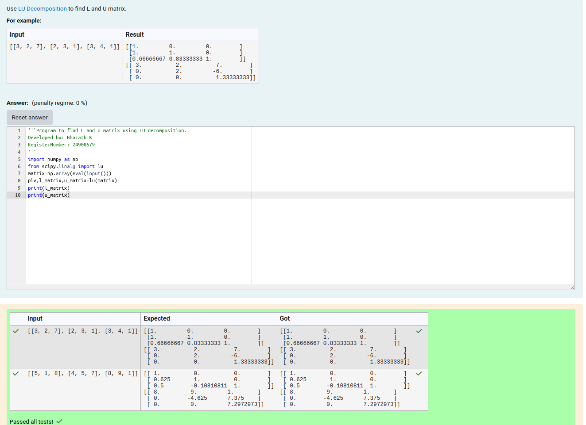
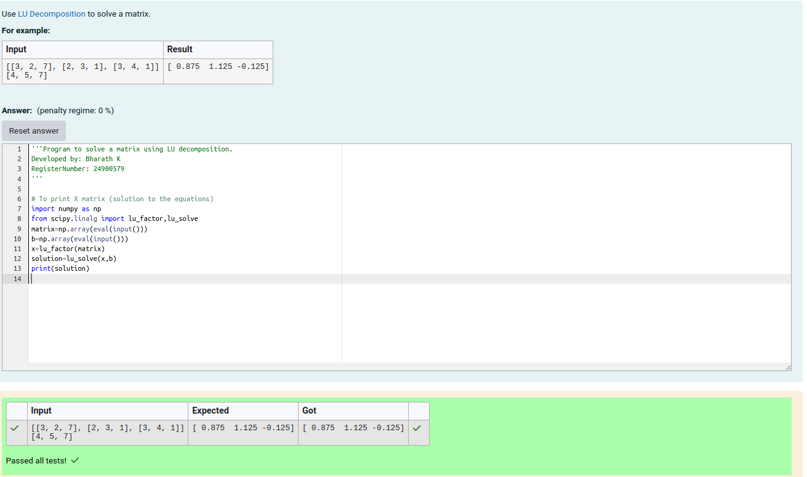

# LU Decomposition 

## AIM:
To write a program to find the LU Decomposition of a matrix.

## Equipments Required:
1. Hardware – PCs
2. Anaconda – Python 3.7 Installation / Moodle-Code Runner

## Algorithm
(i) To find the L and U matrix

1. Take the input as a square matrix A,
2. Convert the input into a Numpy array for mathematical operations.
3. Use the lu function from the scipy .linalg library to compute the LU decomposition of matrix A,which returns permutation matrix p, lower triangular matrix L, and upper triangular matrix U.
4. Print the variable 'L' and 'U'.

(ii) To find the LU Decomposition of a matrix

1. define the package as scipy.linalg import lu.
2. Take two inputs from the user:
   A: A square matrix (coefficient matrix)
   B: A vector (right-hand side of the linear equations).
3. Convert the inputs into Numpy arrays for the numerical operations.
4. Use the lu_factor function from scipy.linalg to compute the 
LU decomposition of a matrix A. This returns:
lu: Combined LU decomposition.
piv: Pivot indicates.
5. Use lu_slove with the LU decomposition (lu,piv) and vector b to compute the solution vector x.
6. Print the variable 'X'.

## Program:
(i) To find the L and U matrix
```
/*
Program to find the L and U matrix.
Developed by: Bharath K 
RegisterNumber: 24900579
*/
import numpy as np
from scipy.linalg import lu
matrix=np.array(eval(input()))
piv,l_matrix,u_matrix=lu(matrix)
print(l_matrix)
print(u_matrix)
```
(ii) To find the LU Decomposition of a matrix
```
/*
Program to find the LU Decomposition of a matrix.
Developed by: Bharath K
RegisterNumber: 24900579
*/
import numpy as np
from scipy.linalg import lu_factor,lu_solve
matrix=np.array(eval(input()))
b=np.array(eval(input()))
x=lu_factor(matrix)
solution=lu_solve(x,b)
print(solution)

```

## Output:
(i) To find the L and U matrix

(ii) To find the LU Decomposition of a matrix



## Result:
Thus the program to find the LU Decomposition of a matrix is written and verified using python programming.

